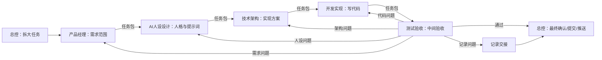

# 多线程协作流程

本项目采用“总控 + 专业线程”的协作方式。核心原则是：各司其职、主动交接、全程留痕、问题按类型返工。

## 角色边界

### 总控

总控像项目老板或负责人，只做这些事：

- 面向用户沟通。
- 拆分大任务，指定负责线程。
- 维护线程登记、阶段日志和任务状态。
- 回收专业线程交接结果。
- 根据测试结论决定返工或进入下一阶段。
- 做最终确认、提交、推送和阶段汇报。

总控不做这些事：

- 不替专业线程写功能代码。
- 不替测试验收做中间验收。
- 不替产品、人设、架构做专业判断，除非对应线程明确阻塞。
- 不在专业线程执行中并行抢同一任务。

### 专业线程

专业线程只做自己的职责范围，不插手其他线程：

- 产品经理：需求、场景、优先级、用户流程。
- AI人设设计：伴侣人格、提示词、情绪回应、安全边界。
- 技术架构：模块边界、数据模型、接口方案、扩展路径。
- 开发实现：写代码、修 bug、运行开发验证。
- 测试验收：中间验收、问题分级、返工建议。
- 记录交接：阶段记录、交接一致性、文档结构。

## 主动交接机制

每个专业线程完成任务后，必须做两件事：

1. 在本线程最后回复中输出 `TASK_HANDOFF.md` 格式的交接记录。
2. 明确写出“建议交接给谁”和“交接任务包”。

如果有可用的线程发送工具，并且目标线程明确、任务不涉及用户决策或高风险操作，专业线程应把任务包发送给下一个线程。

为了避免乱发，直接发送必须满足这些条件：

- 只能发送给 `THREAD_REGISTRY.md` 中登记的线程。
- 只能发送和自己产出直接相关的下一步任务。
- 必须使用“给下一个线程的任务包”格式。
- 必须在自己的最终交接记录里写明已经交给哪个线程。
- 如果目标不明确、需要用户确认、涉及发布/付费/隐私/删除数据，必须交回总控。

## 不死等原则

专业线程把任务包发送给下一个线程后，本线程的当前任务就结束：

- 不轮询下一个线程。
- 不等待下一个线程完成。
- 不追踪下一个线程的中间过程。
- 不继续替下一个线程做判断或补工作。
- 只在收到总控或用户的新任务时继续工作。

总控也不持续盯过程，只在阶段节点、测试结论、返工结论、最终提交前回收结果。

## 交接任务包格式

```md
## 给下一个线程的任务包

- 目标线程：
- 任务类型：
- 背景：
- 必读文件：
- 输入材料：
- 具体任务：
- 不要做：
- 验收标准：
- 完成后交接给：
```

## 标准流转

工程化升级阶段按 `docs/PROJECT_ORCHESTRATION.md` 执行默认主线：产品经理 -> 技术架构 -> 开发实现 -> 测试验收 -> 总控。AI人设设计只在伴侣口吻、提示词、安全回应或情绪体验问题出现时介入。



## 返工规则

- 阻塞问题必须返工，不能提交为阶段完成。
- 普通问题由总控判断是否进入返工或记录为下一轮。
- 可后续优化不阻塞当前阶段首个可验收版本，但必须记录。
- 返工必须写明问题来源、复现方式、期望结果和退回线程。

## 记录要求

总控维护 `docs/HANDOFF_LOG.md`，记录：

- 哪个线程完成了什么。
- 修改了哪些文件或产出了哪些方案。
- 验证方式和结果。
- 发现的问题与退回对象。
- 当前阶段是否可以进入下一步。

专业线程不直接改阶段日志，除非总控明确交给“记录交接线程”执行文档维护任务。

## 总控介入条件

总控只在这些情况下介入线程流转：

- 新的大任务开始。
- 用户提出新要求或改变方向。
- 线程目标不明确。
- 线程之间判断冲突。
- 任务涉及账号、权限、登录、付费、发布、删除数据或隐私风险。
- 测试验收给出最终通过或返工结论。
- 需要提交、推送或对用户汇报阶段结果。
